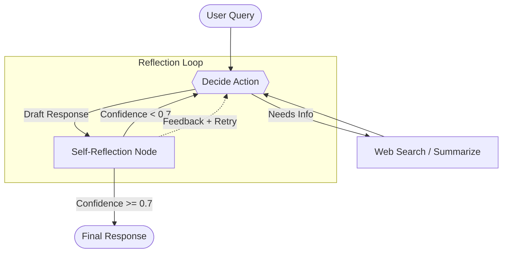

# Agentic AI Research Assistant

[](https://github.com/aniketpoojari/Agentic-AI-Research-Assistant/actions/workflows/test.yml)
[](https://opensource.org/licenses/MIT)
[](https://www.python.org/downloads/)
[](https://huggingface.co/spaces/aniketp2009gmail/research-assistant-5)

An autonomous research agent that searches, reflects, verifies, and corrects itself before delivering an answer. Built to reduce LLM hallucinations for research tasks.

## The Problem

LLMs are prone to hallucinations -- confidently stating things that aren't true. For research tasks, this is unacceptable.

## The Solution

Instead of a linear "search then answer" pipeline, this agent uses a **self-reflection loop** powered by [LangGraph](https://github.com/langchain-ai/langgraph):

1. **Generate** -- draft a response from web search results
2. **Critique** -- check every claim against retrieved evidence
3. **Refine** -- re-search and revise if confidence is below 0.7

## Architecture



## Tech Stack

| Component | Technology |
|-----------|-----------|
| Agent framework | LangGraph |
| LLM | Groq (Llama 3.x) |
| Web search | Tavily / DuckDuckGo |
| Evaluation | Ragas |
| Tracing | LangSmith |
| Backend API | FastAPI |
| Frontend | Streamlit |
| Deployment | Docker, HuggingFace Spaces |
| CI/CD | GitHub Actions |

## Quick Start

```bash
# Clone
git clone https://github.com/aniketpoojari/Agentic-AI-Research-Assistant.git
cd Agentic-AI-Research-Assistant

# Install
python -m venv venv
source venv/bin/activate  # Windows: venv\Scripts\activate
pip install -r requirements.txt

# Configure
cp .env.example .env
# Edit .env with your API keys (see Environment Variables below)

# Run
uvicorn main:app --reload          # API at http://localhost:8000
streamlit run app.py               # UI at http://localhost:8501
```

### Docker

```bash
docker build -t research-assistant .
docker run -p 7860:7860 -p 8000:8000 \
  -e GROQ_API_KEY=your_key \
  -e TAVILY_API_KEY=your_key \
  research-assistant
```

## Environment Variables

| Variable | Required | Description |
|----------|----------|-------------|
| `GROQ_API_KEY` | Yes | Groq API key for LLM inference |
| `TAVILY_API_KEY` | Yes | Tavily API key for web search |
| `MODEL_NAME` | No | Model name (default: `llama-3.1-8b-instant`) |
| `LANGCHAIN_API_KEY` | No | LangSmith API key for tracing |

## API Endpoints

| Method | Endpoint | Description |
|--------|----------|-------------|
| `POST` | `/research` | Run a research query |
| `POST` | `/research/stream` | Stream research results (SSE) |
| `GET` | `/health` | Health check |
| `GET` | `/reflection-stats` | Self-reflection metrics |
| `GET` | `/cache/stats` | Cache hit rates |
| `GET` | `/metrics` | Performance metrics |

### Example Request

```bash
curl -X POST http://localhost:8000/research \
  -H "Content-Type: application/json" \
  -d '{"query": "What are the latest breakthroughs in solid-state batteries?", "max_results": 5}'
```

## Evaluation

The project includes two evaluation systems:

- **`evaluation/`** -- Ragas evaluation that scores the agent on faithfulness, relevancy, context precision, and recall. Runs automatically in CI via GitHub Actions.
- **`benchmarking/`** -- Comparative benchmark that tests the agent head-to-head against a baseline LLM on the same queries.

```bash
# Run evaluation
python evaluation/run_evaluation.py

# Run comparative benchmark
python -m benchmarking.benchmark --num 10
```

## Project Structure

```
.
├── agent/              # LangGraph agent workflow
├── app.py              # Streamlit frontend
├── benchmarking/       # Agent vs baseline comparison
├── config/             # YAML configuration
├── evaluation/         # Ragas evaluation + test queries
├── logger/             # Logging setup
├── main.py             # FastAPI backend
├── models/             # Model definitions
├── prompt_library/     # System prompts
├── tools/              # LangChain tool wrappers
├── utils/              # Config loader, web search, cache
├── Dockerfile          # Multi-stage Docker build
└── requirements.txt    # Python dependencies
```

## Contributing

See [CONTRIBUTING.md](CONTRIBUTING.md) for guidelines.

## License

MIT -- see [LICENSE](LICENSE) for details.
