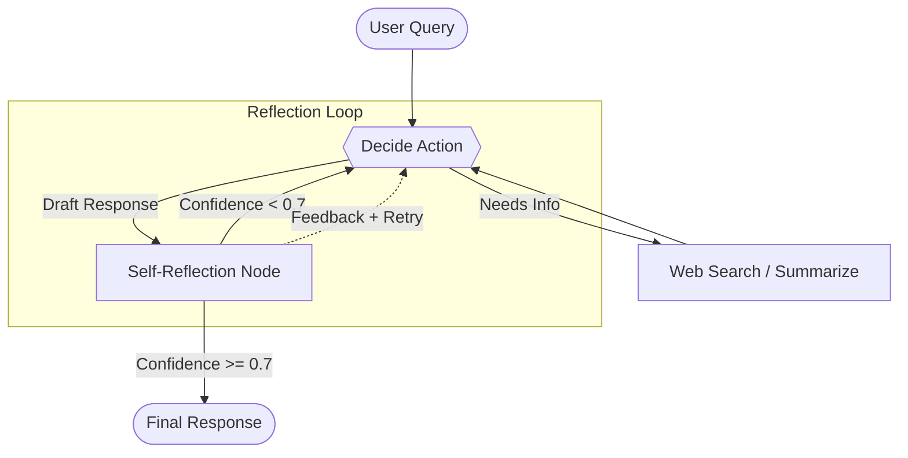

# System Design: Agentic AI Research Assistant

## 1. Overview
The **Agentic AI Research Assistant** is an autonomous system designed to eliminate LLM hallucinations during research tasks. Instead of simply generating a response based on a prompt, the system employs a robust **Generate-Critique-Refine** loop. It searches the web, drafts a response, evaluates its own claims against retrieved evidence, and re-searches if the confidence score is too low.

This application is deployed on **Hugging Face Spaces** for easy access and demonstration.

## 2. Core Architecture

The architecture is built on a cyclical directed graph using **LangGraph**:

### Components
1. **Frontend (Streamlit)**: A simple, interactive UI hosted on Hugging Face Spaces where users can submit research queries and view the agent's thought process.
2. **Backend API (FastAPI)**: Serves the LangGraph agent, handling incoming queries, managing the agent's state, and returning responses.
3. **Agent Workflow (LangGraph)**:
    - **Generator**: Uses Groq (Llama 3) to process the query, decide if web search is needed, and draft an initial response.
    - **Tools**: Integrates with Tavily/DuckDuckGo for real-time internet search and data gathering.
    - **Critic (Reflection)**: Evaluates the draft against retrieved context. If the faithfulness or confidence is below 0.7, it sends feedback to the Generator to try again.
4. **Evaluation Engine (Ragas)**: A built-in suite that benchmarks the agent against standard LLM baselines on metrics like faithfulness, context precision, and recall.

## 3. Design Choices & Trade-offs

* **LangGraph over LangChain Chains**: Chose LangGraph to enable cyclical, stateful workflows. Standard chains are linear and cannot easily handle the "Critique & Refine" looping behavior necessary for autonomous agents.
* **Groq API**: Selected for its ultra-fast inference speeds, which is critical since the agent might make multiple LLM calls in a single loop before returning an answer.
* **Tavily vs. Standard Search**: Tavily is optimized for LLM consumption, returning concise summaries rather than raw HTML, reducing token usage and parsing time.
* **Hugging Face Spaces Deployment**: Chosen for seamless hosting of the Streamlit interface and Dockerized FastAPI backend, making the project instantly accessible to recruiters and users.

## 4. Data Flow

1. User submits a query via the **Streamlit UI**.
2. Streamlit forwards the request to the **FastAPI `/research` endpoint**.
3. **LangGraph State** is initialized. The Agent node is triggered.
4. The Agent determines it needs facts and calls the **Tavily Web Search Tool**.
5. The Tool returns summarized web results. The Agent drafts a response.
6. The **Critic Node** receives the draft and the context. It scores the response.
7. If the score is `< 0.7`, the workflow routes back to the Agent with instructions on what to fix.
8. If the score is `>= 0.7`, the workflow routes to the `FinalResponse` node.
9. FastAPI returns the verified answer to Streamlit, which displays it to the user.

## 5. Security & Guardrails
* **Context Grounding**: The system is strictly instructed to answer *only* using retrieved context.
* **API Key Management**: Managed securely via environment variables (in local environments) and Hugging Face Secrets (in production).
